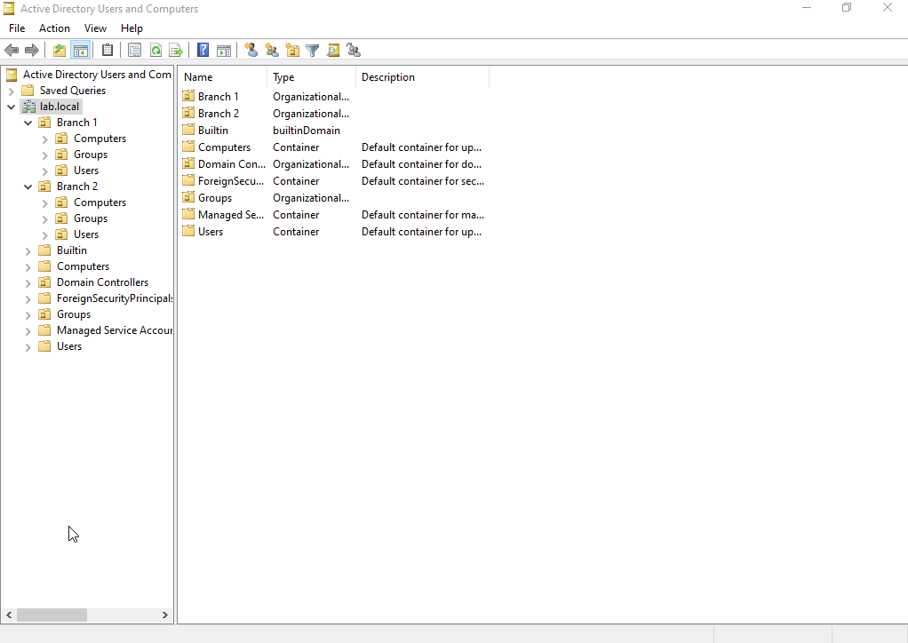
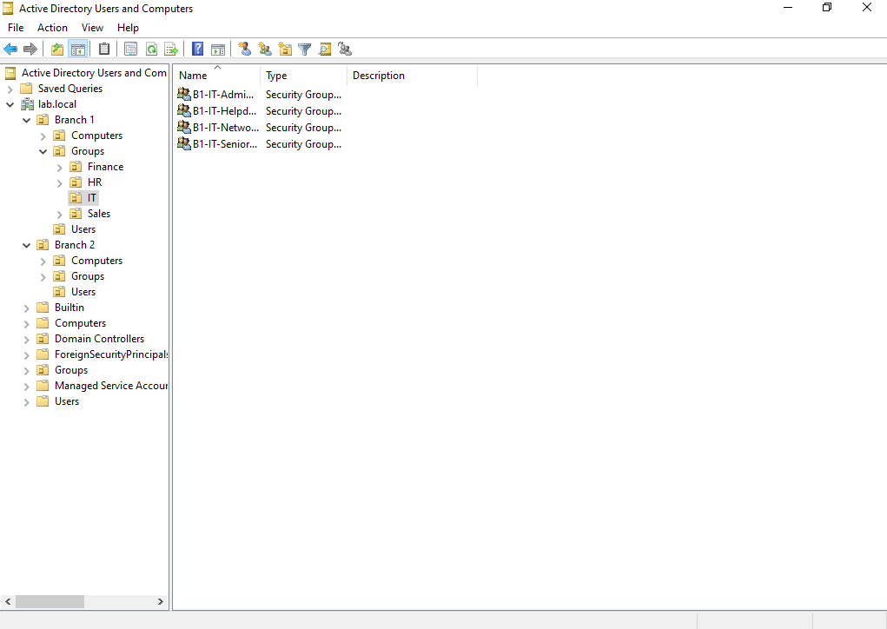
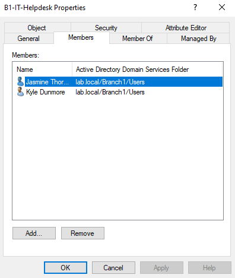
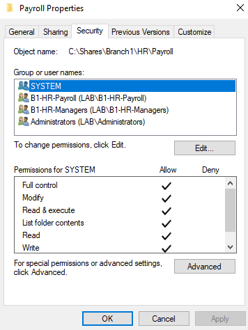
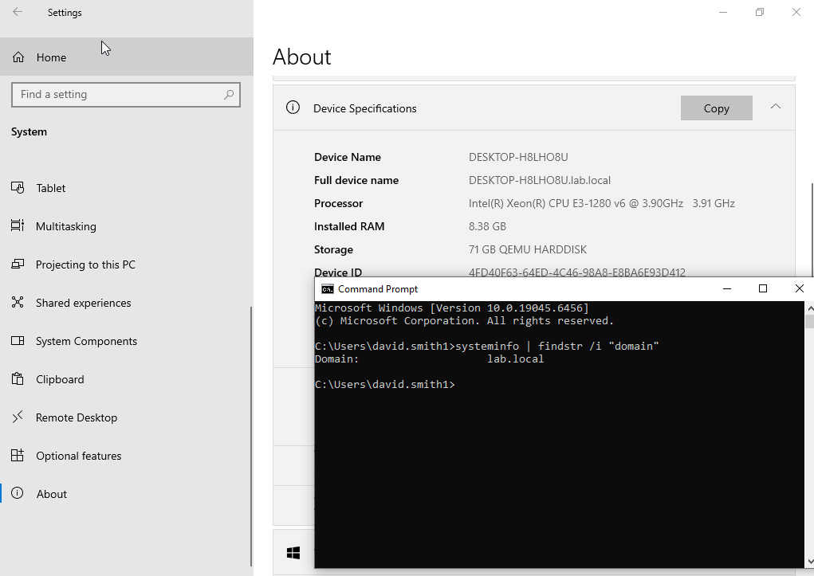

# Active Directory Lab | Proxmox Homelab

A Windows Active Directory environment built from scratch in a Proxmox virtual lab. Simulates a small enterprise network across two geographically separated branches with full departmental structure, role-based access control, and domain-authenticated workstations.

> **Focus areas:** Identity management, group-based access control, NTFS permissions, domain authentication, OU design

---

## Environment

| Component | Details |
|---|---|
| Hypervisor | Proxmox VE |
| Domain Controller | Windows Server (AD DS, DNS) |
| Client Workstation | Windows 10 (domain-joined) |
| Services | Active Directory Domain Services, DNS, NTFS file sharing |

---

## Domain Structure

The domain is organized using a branch-based OU hierarchy with departmental separation inside each site. This reflects how enterprise environments segment identity management across physical or logical locations.

```
lab.local
├── Branch1
│   ├── IT
│   ├── HR
│   ├── Finance
│   └── Sales
└── Branch2
    ├── IT
    ├── HR
    ├── Finance
    └── Sales
```


*Active Directory Users and Computers showing Branch1 and Branch2 expanded with all department OUs visible*

---

## User and Group Management

User accounts are created within each branch and placed into their corresponding department OUs. All permission assignments are handled through security groups. No permissions are applied directly to individual user accounts.

Security groups follow a `BRANCH-DEPARTMENT-ROLE` naming convention:

| Group | Role |
|---|---|
| B1-IT-Helpdesk | Tier 1 support access |
| B1-IT-Senior-Helpdesk | Elevated support access |
| B1-IT-Network-Engineers | Infrastructure access |
| B1-IT-Administrators | Full domain control |


*Branch1 > IT > Groups showing security groups inside the department OU*

Group membership was verified to confirm all groups are actively populated, not just created.


*B1-IT-Helpdesk group Members tab showing assigned user accounts*

---

## Access Control (NTFS Permissions)

Shared folders were created for each department. Access is assigned exclusively through security groups, enforcing separation between departments and branches. No individual user accounts appear in any access control list.

| Permission | Assigned To |
|---|---|
| Read | B1-IT-Helpdesk |
| Modify | B1-IT-Senior-Helpdesk, B1-IT-Network-Engineers |
| Full Control | B1-IT-Administrators |


*Folder Properties > Security tab showing domain security groups with explicit permission levels assigned*

---

## Domain Authentication

A Windows 10 workstation was joined to the domain and used to validate the full authentication flow across multiple user accounts and roles. Access to shared resources was tested per role and unauthorized access attempts were confirmed to be correctly denied.


*Command prompt output confirming the workstation is joined to lab.local*

---

## Validation

- [x] Windows 10 client successfully joined to the domain
- [x] User authentication verified across multiple accounts and roles
- [x] Shared resource access confirmed correct per role
- [x] Unauthorized access attempts correctly denied
- [x] DNS resolution confirmed within the domain

---

## Skills Demonstrated

- Active Directory administration (users, groups, OUs)
- Organizational Unit design using a branch-based hierarchy
- Role-based access control (RBAC) via security groups
- NTFS permissions and file-level access control
- Domain authentication and client management
- Virtualization using Proxmox VE

---

## What I Would Expand Next

- Group Policy Objects (GPOs) for desktop lockdown, password policy, and drive mapping
- Fine-grained password policies per department
- Tiered admin model (Tier 0/1/2) to simulate PAW architecture
- Read-only Domain Controller (RODC) for Branch2 to reflect a real remote-site setup
- Audit policy and event log review for login and access events
